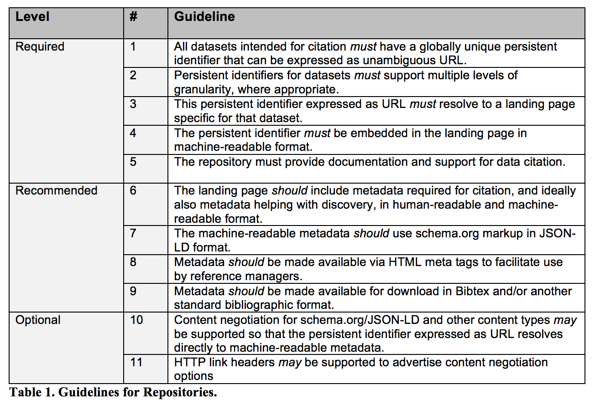

# Publishing and Citing Datasets

This guideline supports Data Systems workflows by ensuring datasets referenced in publications are
openly accessible, properly identified with DOIs, and cited according to community standards. It
aligns with publisher and funder policies and promotes scientific reproducibility.

## Dataset Publishing and Citation Workflow
The process of publishing and citing datasets involves several key steps:

1. **Understand Publisher Requirements** - [DOIs](digital_object_identifiers.md) and [ORCIDs](https://orcid.org/) may be required by publishers to maintain compliance with submission guidelines
2. **Make Data Open and Accessible** - Store datasets in publicly accessible, machine-readable formats
2. **Create a DOI and Landing Page** - Register a persistent identifier that resolves to a landing page with comprehensive dataset information.
3. **Maintain Metadata** - Keep DOI metadata accurate and up to date
4. **Cite Datasets Properly** - Follow established data citation principles in publications. Reference
   the [Force 11 Joint Declaration of Data Citation Principles](https://www.force11.org/datacitationprinciples) and
   follow practices described in the [ESIP Dataset Citation Guidelines](https://doi.org/10.6084/m9.figshare.8441816).

## Publishing Options:

1. **LASP Data Management Group**
   This group can assist with minting a DOI for LASP hosted datasets and provide guidance on navigating CU resources
   available for data publishing and archiving needs (some described below).

2. **CU Libraries**
   Researchers can create DOIs and landing pages for datasets using CU Libraries' integration with DataCite.

3. **CU Scholar**
   CU Scholar can host articles, reports, and datasets of limited size. CU Scholar prefers to generate and manage DOIs
   for hosted datasets. They also require data providers to have a reference to a landing page for the DOI to point to.

4. **CU Center for Research Data and Digital Scholarship (CRDDS)**
   CRDDS provides guidance and services to assist researchers with making their scholarship (e.g., data sets, journals,
   articles, preprints/postprints, etc.) available to a broader audience.

5. **External Repositories**
   For larger datasets or specialized data types, external repositories that support DOI assignment can be considered.

6. **LASP DOI Management (Future Direction)**
   LASP can develop internal resources for creating and managing DOIs and dataset landing pages, streamlining the
   process for LASP-affiliated data products.

## Quick Start Guide
As of 2018, CU Libraries is a member of DataCite.  Through this membership, LASP can mint and
register a limited number of DOIs for datasets housed in our repositories, enabling data to be persistently identified,
accessed, and cited. For LASP-affiliated datasets, researchers can work with the LASP Data Management team
to create DOIs and get advice on CU resources available to support publishing datasets.

1. **Submit a Request**
   - Researchers: File a Jira issue with type "DOI" in the [Data Management Jira project](https://jira.lasp.colorado.edu/projects/DATAMAN/).

2. **Prepare Required Metadata**
   - Work with the Data Management team to ensure proper metadata and landing page are available.
   - Minimum required metadata for DOI creation:
     - URL of the landing page (not the dataset itself)
     - Creators (list of names)
     - Title
     - Publisher (typically LASP or a project within LASP)
     - ResourceType (usually `dataset`)
   - DataCite supports additional metadata. Those properties are described here: https://support.datacite.org/docs/metadata-quality.

3. **Create DOI via DataCite**
   - Data Management team logs into [doi.datacite.org](https://doi.datacite.org/) using the `CUB.LASP` repository ID.
   - Click "DOIs" → "Create DOI (Form)"
   - Use the form to enter metadata. See full field descriptions at: [DataCite Field Descriptions](https://support.datacite.org/docs/field-descriptions-for-form)
   - For developers: There is an [API](https://support.datacite.org/docs/api) that reads the full metadata schema.

4. **Maintain DOI Metadata**
   - Keep DOI metadata up to date in the [DataCite Metadata Store](https://support.datacite.org/docs)
   - If a dataset is moved, update the registry.
   - If a dataset is removed, maintain a “tombstone” landing page.

5. **Follow DOI Best Practices**
   - Use landing pages (not direct links to datasets).
   - Maintain metadata quality and completeness as information changes.
   - See [Metadata Guidelines](metadata.md) for dataset metadata requirements.

6. **Adhere to Roles and Responsibilities**
    LASP (as a DataCite Client) must meet responsibilities outlined in:
    - [DataCite Community Responsibility](https://support.datacite.org/docs/community-responsibility)
    - [Data Citation Roadmap for Scholarly Data Repositories](https://www.biorxiv.org/content/biorxiv/early/2017/10/09/097196.full.pdf)

## Useful Links

- [CU Scholar](https://scholar.colorado.edu/about)
- [CU Center for Research Data and Digital Scholarship (CRDDS)](https://www.colorado.edu/crdds/what-we-do/open-research-publishing)
- [CU Peta Library](https://www.colorado.edu/petalibrary/)
- [Force 11 Joint Declaration of Data Citation Principles](https://www.force11.org/datacitationprinciples)
- [ESIP Dataset Citation Guidelines](https://doi.org/10.6084/m9.figshare.8441816)
- [Zenodo DOI Citation Guide](https://doi.org/10.5281/zenodo.1451971)
- [Data Citation Roadmap (Scholarly Repositories)](https://www.biorxiv.org/content/biorxiv/early/2017/10/09/097196.full.pdf)
- [ORCID](https://orcid.org/)
- [Intro to Digital Object Identifiers](digital_object_identifiers.md)
- [DataCite](https://doi.datacite.org/)
- [Field Descriptions for DOI Form](https://support.datacite.org/docs/field-descriptions-for-form)
- [DataCite Metadata Quality](https://support.datacite.org/docs/metadata-quality)
- [DataCite Community Responsibility](https://support.datacite.org/docs/community-responsibility)
- [Data Citation Roadmap (Scholarly Repositories)](https://www.biorxiv.org/content/biorxiv/early/2017/10/09/097196.full.pdf)
- [Intro to DataCite REST API](https://support.datacite.org/docs/api)
- [Metadata Requirements](metadata.md)
- [NASA EOSDIS DOI Guidelines](https://wiki.earthdata.nasa.gov/display/DOIsforEOSDIS)
- [Creating a DOI for Software](../workflows/open_source/citing_software.md)
- [DOIs for SORCE Data Products](https://confluence.lasp.colorado.edu/pages/viewpage.action?pageId=21464459)
  (Confluence)

## Acronyms

- **API** = Application Programming Interface
- **CRDDS** = Center for Research Data and Digital Scholarship
- **DOI** = Digital Object Identifier
- **NASA** = National Aeronautics and Space Administration
- **ORCID** = Open Researcher and Contributor ID
- **ESIP** = Earth Science Information Partners

Credit: Content adapted from Confluence guides written by Anne Wilson, Shawn Polson and Doug Lindholm.
