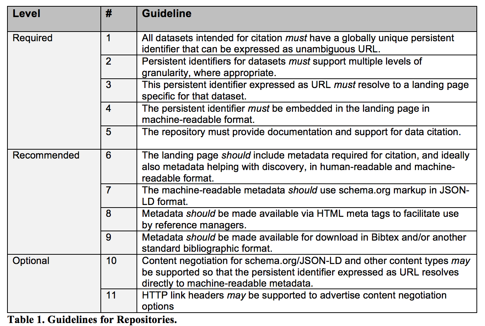

# Creating a DOI via CU Libraries and DataCite

As of 2018, CU Libraries is a member of DataCite.  Through this membership, LASP can mint and
register DOIs for datasets housed in our repositories, enabling data to be persistently identified,
accessed, and cited.

Guidelines for assigning Digital Object Identifiers (DOIs) to datasets using this
membership, including steps for request, metadata requirements, and long-term
responsibilities are outlined here.

## Purpose

This guideline supports LASP’s data publishing workflows by enabling the creation and registration
of persistent identifiers (DOIs) for datasets using CU resources. These identifiers help ensure
long-term access, discoverability, and proper citation of data.

## How to create a DOI

Dataset DOIs should resolve to a dataset landing page providing information about the dataset like where it can be
accessed. CU libraries automatically generates a generic landing page populated with high level metadata on datasets
provided in a DOI request form. Whereas CU Scholar, another CU resource, requires data providers to have a reference to
such a landing page when creating a DOI.

Note, that the number of DOIs allocated to LASP is limited.

1. **Submit a Request**
   - Researchers: File a Jira issue with type "DOI" in the [Data Management Jira project](https://jira.lasp.colorado.edu/projects/DATAMAN/).

2. **Prepare Required Metadata**
   - Work with the Data Management team to ensure proper metadata and landing page are available.
   - Minimum required metadata for DOI creation:
     - URL of the landing page (not the dataset itself)
     - Creators (list of names)
     - Title
     - Publisher (typically LASP or a project within LASP)
     - ResourceType (usually `dataset`)
   - DataCite supports additional metadata. Those properties are described here: https://support.datacite.org/docs/metadata-quality.

3. **Create DOI via DataCite**
  - Data Management team logs into [doi.datacite.org](https://doi.datacite.org/) using the `CUB.LASP` repository ID.
  - Click "DOIs" → "Create DOI (Form)"
  - Use the form to enter metadata. See full field descriptions at: [DataCite Field Descriptions](https://support.datacite.org/docs/field-descriptions-for-form)
  - For developers: There is an [API](https://support.datacite.org/docs/api) that reads the full metadata schema.

4. **Maintain DOI Metadata**
  - Keep DOI metadata up to date in the [DataCite Metadata Store](https://support.datacite.org/docs)
  - If a dataset is moved, update the registry.
  - If a dataset is removed, maintain a “tombstone” landing page.

5. **Follow DOI Best Practices**
  - Use landing pages (not direct links to datasets).
  - Maintain metadata quality and completeness as information changes.
  - See [Metadata Guidelines](metadata.md) for dataset metadata requirements.

6. **Adhere to Roles and Responsibilities**

    LASP (as a DataCite Client) must meet responsibilities outlined in:
    - [DataCite Community Responsibility](https://support.datacite.org/docs/community-responsibility)
    - [Data Citation Roadmap for Scholarly Data Repositories](https://www.biorxiv.org/content/biorxiv/early/2017/10/09/097196.full.pdf)

## Getting Help

Please use the [DATAMAN](https://jira.lasp.colorado.edu/secure/RapidBoard.jspa?rapidView=1430) project on MODS-Jira to
submit a ticket, and someone from the Data Management Working Group will respond to it.

## Useful Links

- [Intro to Digital Object Identifiers](digital_object_identifiers.md)
- [DataCite](https://doi.datacite.org/)
- [Field Descriptions for DOI Form](https://support.datacite.org/docs/field-descriptions-for-form)
- [DataCite Metadata Quality](https://support.datacite.org/docs/metadata-quality)
- [DataCite Community Responsibility](https://support.datacite.org/docs/community-responsibility)
- [Data Citation Roadmap (Scholarly Repositories)](https://www.biorxiv.org/content/biorxiv/early/2017/10/09/097196.full.pdf)
- [Intro to DataCite REST API](https://support.datacite.org/docs/api)
- [Metadata Requirements](metadata.md)
- [NASA EOSDIS DOI Guidelines](https://wiki.earthdata.nasa.gov/display/DOIsforEOSDIS)
- [CU Scholar](https://scholar.colorado.edu/about)
- [Creating a DOI for Software](../workflows/open_source/citing_software.md)

## Acronyms

- **DOI** = Digital Object Identifier
- **NASA** = National Aeronautics and Space Administration
- **EOSDIS** = Earth Observing System Data and Information System
- **API** = Application Programming Interface

Credit: Content taken from a Confluence guide written by Anne Wilson and updated by Doug Lindholm
