# Managing Data: Storage, Format, Access

This guide covers storage options, data format choices, and access protocols for datasets to ensure that datasets are
managed in ways that meet open science principles and institutional requirements. It supports Data Systems workflows by
improving data accessibility, promoting reproducibility, and enhancing usability and compliance with funder and
publisher requirements.

## Storage

Here we assume that a dataset must be publicly accessible: machine readable on a public network in a manageable format.
Storage on local disks or external hard drives is not considered open and accessible.

Storage choice depends on many factors, including dataset size, access needs, performance needs, need for
authentication, other data management needs (e.g., the need for a DOI), etc.

LASP resources

- LISIRD, for solar irradiance and related data products
- LASP options: (e.g. dsapps, lasp-store)
- LEMR for metadata

CU Boulder resources

- CU Scholar is suitable for small datasets that provides a DOI, a generically-styled landing page, and some storage.
- CU Boulder PetaLibrary for information about CU Research Computings PetaLibrary storage resources.

External repositories

- Dryad: a curated resource that makes research data discoverable, freely reusable, and citable.
- Figshare: a web-based interface designed for academic research data management and research data dissemination.
  It accepts all file types (with in-browser viewing).
- Simple storage in the cloud: AWS Glacier, S3
- Fedora, Zenodo, Open Science Framework, Dataverse

## Data Formats

To maximize the potential application of tools to data, data should be provided in common, open, self-describing,
machine readable formats such as:

- netCDF/HDF
- CDF
- ASCII
- FITS
- JSON

What is considered 'common' may vary somewhat by science domain. The use of proprietary data formats, such as IDL
".sav" files, is discouraged because of the need for a license in order to use the data.

"Self-describing" means that metadata about the data is included in the file or package. Self-describing formats
include: NetCDF, HDF, and CSV with headers. ASCII or CSV data without header information, or binary data, are not
self-describing.

## Machine Readability

Any dataset can be machine readable if one writes one-off code to do so.   However, datasets should be interoperable,
which implies not having to create nor rely on specialized code.

Machine readability isn't a binary condition of a dataset; it's a continuum. The issue is whether one can use a dataset
in an existing tool that conforms to current standards. Use of a common data format or metadata schema is the first
step in achieving machine readability.

There are ways to structure data that foster machine readability, and ways that do not.

To improve machine readability:

- Use consistent naming conventions and delimiters
- Represent missing values clearly
- Include metadata in self-describing formats

### Examples of what to do and what not to do with your data

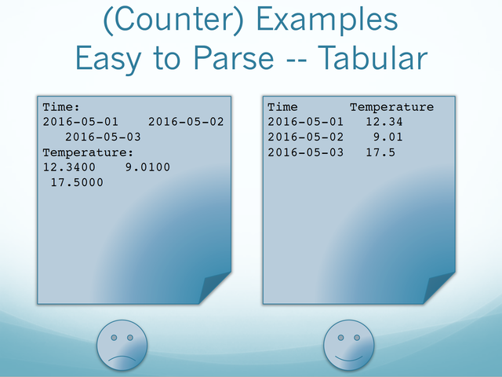
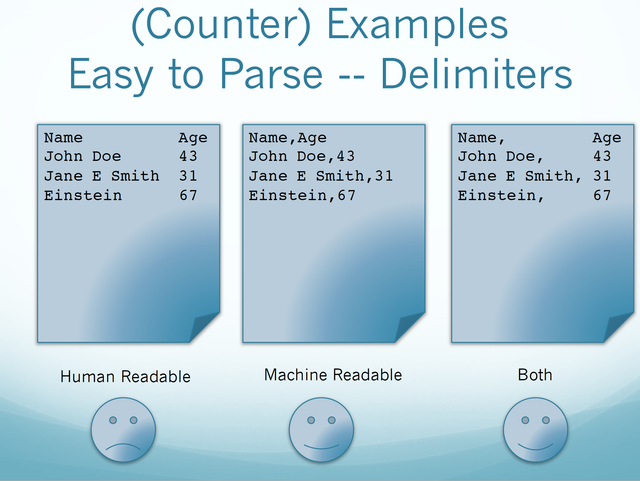
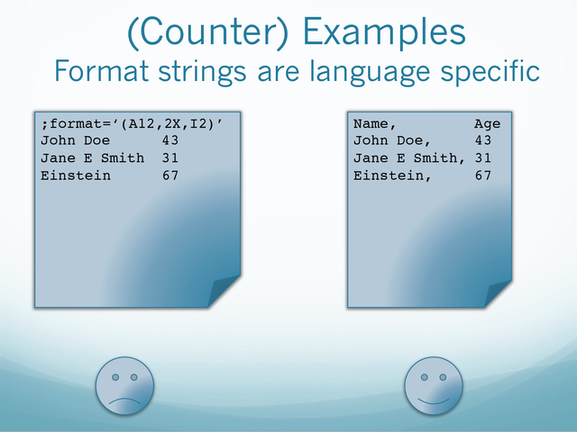
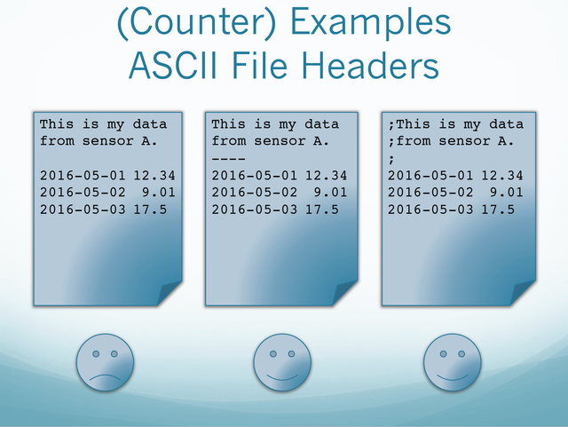
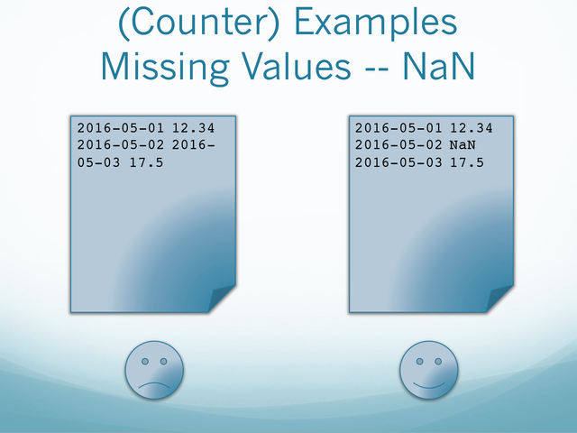
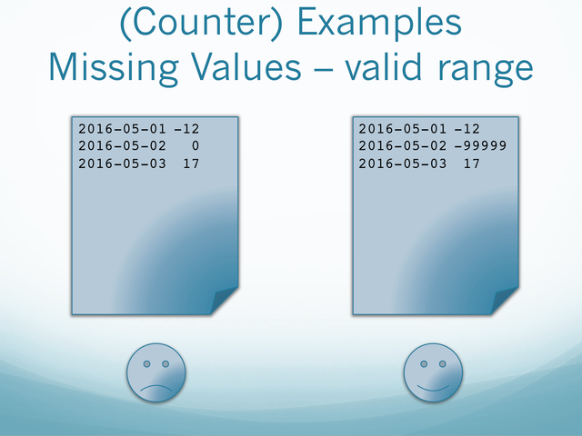
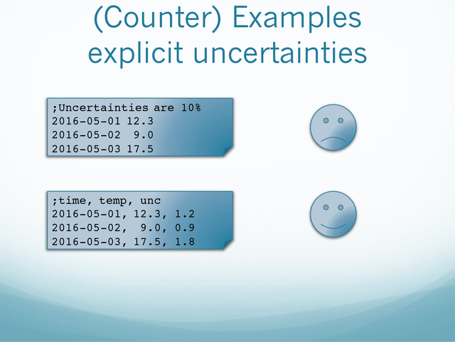
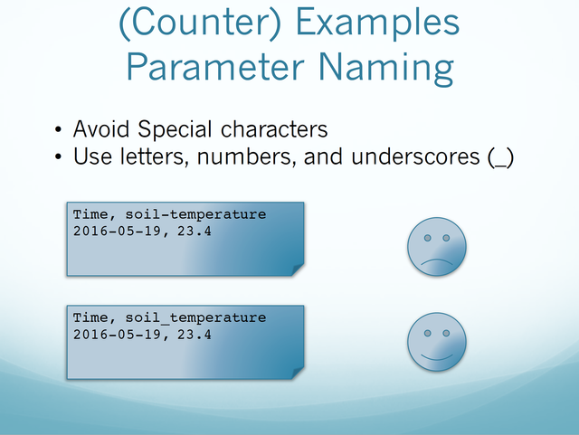
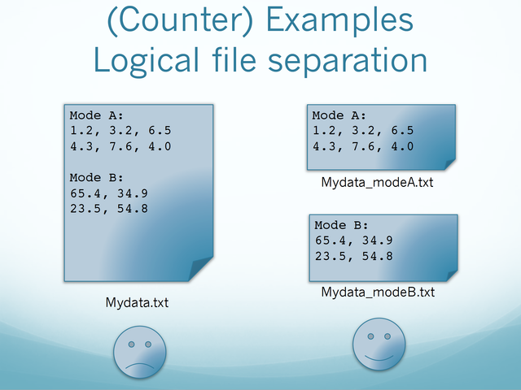
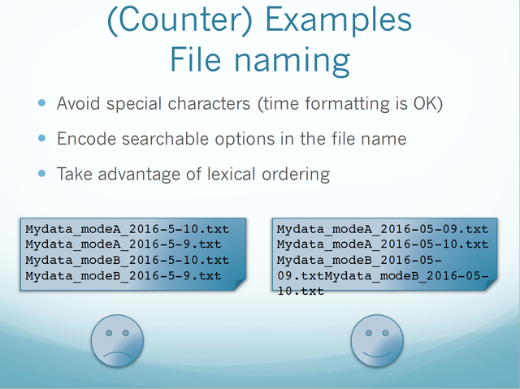
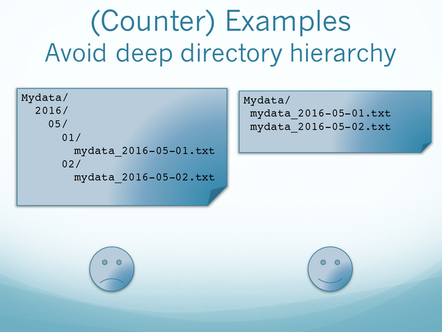
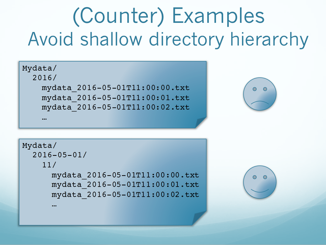
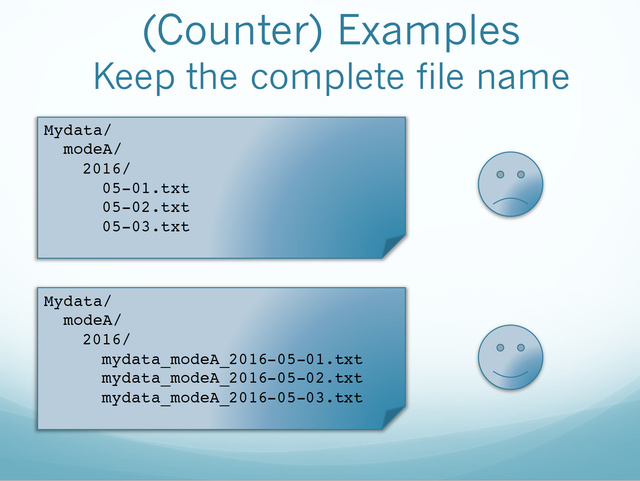
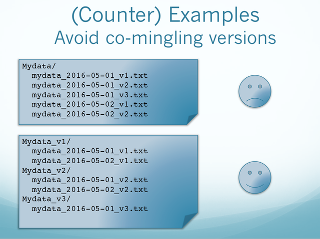
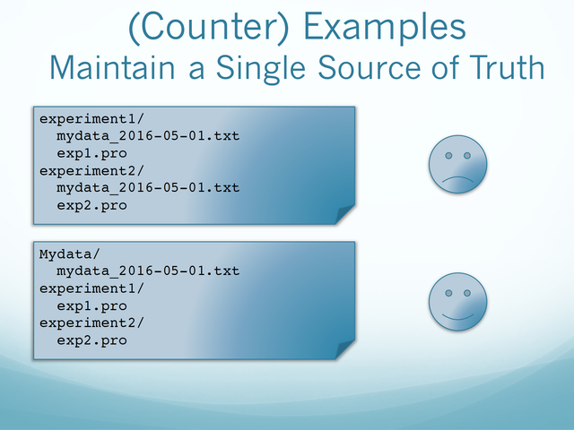
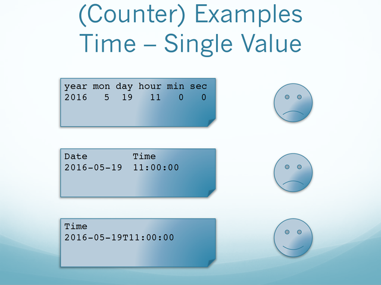
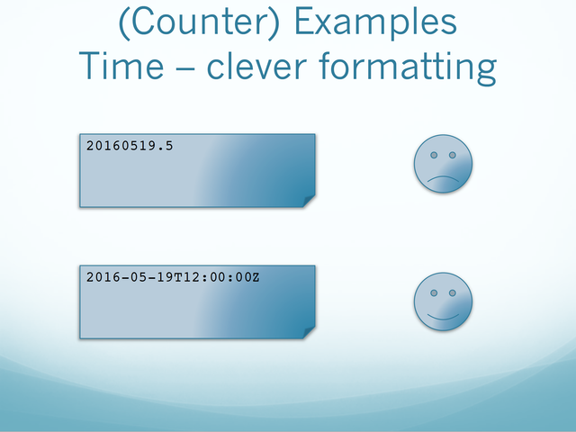
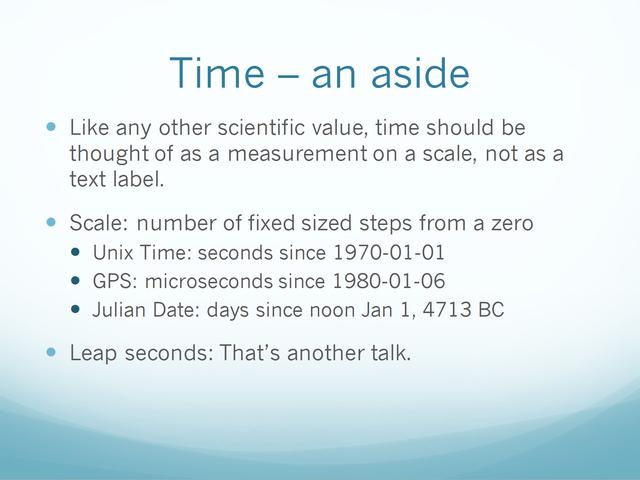
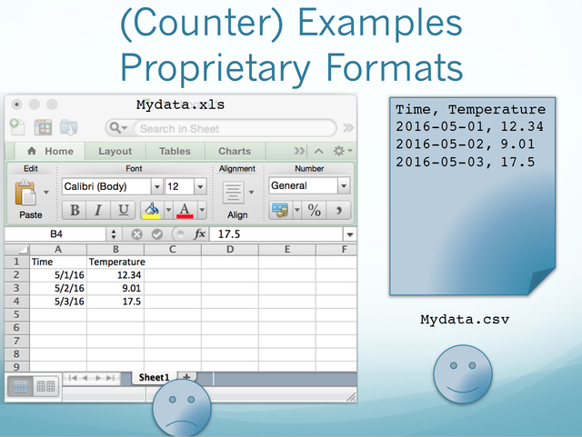
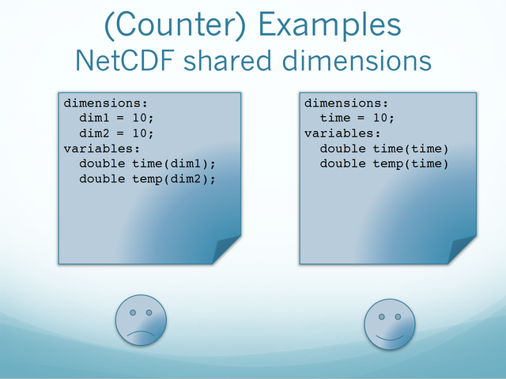

## Useful Links

- [Data Stewardship at LASP](data_stewardship.md)
- [FAIR Principles](fair_principles.md)
- [netCDF](file_formats/netcdf.md)
- [LISIRD](https://lasp.colorado.edu/lisird/)
- [Zenodo](https://zenodo.org/)
- [CU Scholar](https://scholar.colorado.edu/about)
- [CU PetaLibrary](https://www.colorado.edu/rc/resources/petalibrary)
- [Dryad](https://datadryad.org/)
- [Figshare](https://figshare.com/)
- [AWS Glacier](https://aws.amazon.com/glacier/)
- [AWS S3](https://aws.amazon.com/s3/)
- [Fedora](https://duraspace.org/fedora/)
- [Open Science Framework](https://osf.io/)
- [Dataverse](https://dataverse.org/)

## Acronyms

List of acronyms used in the guideline

- **AWS** = Amazon Web Services
- **CDF** = Common Data Format
- **CSV** = Comma-Separated Values
- **DOI** = Digital Object Identifier
- **FITS** = Flexible Image Transport System
- **HDF** = Hierarchical Data Format
- **IDL** = Interactive Data Language
- **LEMR** = LASP Environmental Metadata Repository
- **LISIRD** = LASP Interactive Solar Irradiance Data Center
- **MOU** = Memorandum of Understanding
- **NetCDF** = Network Common Data Form

Credit: Content taken from a Confluence guide written by Anne Wilson and Shawn Polson
