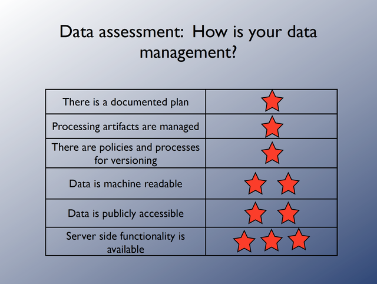
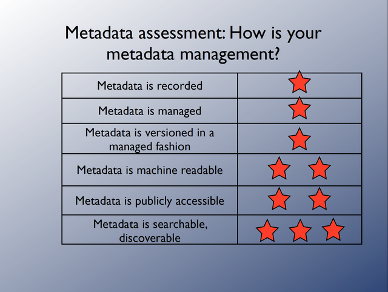
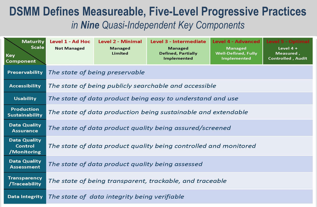

# Data Stewardship at LASP

LASP has a hard-earned, world-class reputation for creating valuable, high-quality
datasets. These datasets, often paid for by U.S. taxpayers, are our legacy.

## Purpose

The world of science is rapidly evolving, particularly in how research data is managed
and how science is conducted. Expectations from government agencies, OSTP, and publishers
around open and accessible research data have significant implications for:

- Scientific conduct and integrity
- Funding for science
- Scientific publication
- Attribution and rewards

By following best practices in data stewardship, LASP ensures its datasets remain
accessible, reproducible, and valuable for the scientific community.

## Key principles

Several key principles guide data stewardship and open science at LASP:

### Open Data

Funding agencies now expect data—and, in some cases, the software that created it—to
be made available beyond the project that produced it. Agencies such as USGS, NASA,
NOAA, and NSF require data management plans in proposals, and funded projects must
meet these responsibilities. This generally includes:

- Making data and metadata publicly accessible.
- Ensuring machine-readability for automated tools.

Organizations such as ESIP, RDA, ESDSWG, and CODATA work to enhance data management and
sharing nationally and internationally.

### Enabling a Science Ecosystem

Scientific artifacts should be [preserved as a lasting world heritage](https://www.agu.org/share-and-advocate/share/policymakers/position-statements/position_data).
As scientific data grows in complexity and scale, interoperable tools, standards, and conventions play a crucial role
in simplifying and automating data processing, analysis, and metadata collection. Data that is
[FAIR](fair_principles.md)—findable, accessible, interoperable, and reusable—is essential to supporting these efforts.

### Reproducibility

A key issue in modern science is the [reproducibility crisis](https://en.wikipedia.org/wiki/Replication_crisis),
where peer reviewers find it difficult to replicate results from many publications. While complete reproducibility
may not always be feasible, best practices in data management ensure:

- Experiments can be rerun, validated, or verified.
- Data and documentation are identifiable and machine-readable.
- Automated tools can process and analyze data.
- Workflow and notebook tools enable shareable, reproducible workflows.

For more on improving reproducibility in Earth science research, see: [EOS article](https://eos.org/opinions/improving-reproducibility-in-earth-science-research).

### Return on Investment

Good data management maximizes the impact of a dataset, allowing for wider use now and in the future. This
benefits both science and society by increasing the return on investment in data collection and analysis.

### Scientific Publication

Publishing is evolving, with journals increasingly requiring:

- Data contributions alongside publications.
- Linking publications with datasets and executable code.

Organizations like [FORCE11](https://www.force11.org/about) advocate for semantically enhanced, media-rich
digital publishing, which is more powerful than traditional print media.

### Attribution for Datasets and Science Software

Funding agencies and publishers are promoting cultural shifts in how datasets and software are credited. High-quality
datasets and software are now recognized as independent scientific contributions.

Since datasets are often generated by software, proper software management is a critical component of data stewardship.
The [Software Sustainability Institute](https://www.software.ac.uk/) supports sustainable research software.

## How to apply these principles

To meet the expectations outlined above:

1. **Develop a Data Management Plan (DMP)**
  - Address how data will be stored, accessed, and shared.
  - Align with agency requirements (e.g., NASA, NSF).

2. **Ensure Open Access**
  - Make datasets and metadata publicly available.
  - Use machine-readable formats when possible.

3. **Use Standardized Metadata and Formats**
  - Follow best practices for documentation and accessibility.
  - Use tools that support automated metadata generation.

4. **Maintain Provenance and Reproducibility**
  - Record data lineage, processing steps, and software versions.
  - Use reproducible workflows and notebook tools.

5. **Publish Data Alongside Research**
  - Link datasets with publications.
  - Provide clear attribution for datasets and software.

6. **Engage with Data Stewardship Communities**
  - Participate in organizations like ESIP, RDA, and CODATA.
  - Follow emerging best practices in open science.

### Assessing data management maturity

To assess data stewardship maturity, consider the following rubrics:

Efforts to define levels of data stewardship maturity have produced useful rubrics that have been shown to help
repositories and projects evaluate and improve their data stewardship efforts.  In particular, and similar to the
CMMI that was developed for process improvement, a maturity matrix for data stewardship was developed.  A high-level
view of that matrix is presented here.  Note that Level 3 was determined to be the recommended level of attainment
for operational digital products stewarded by national data centers.

## Useful Links

- [FAIR Principles](fair_principles.md)
- [AGU Position Statement on Data](https://www.agu.org/share-and-advocate/share/policymakers/position-statements/position_data)
- [Improving Reproducibility in Earth Science Research](https://eos.org/opinions/improving-reproducibility-in-earth-science-research)
- [FORCE11 on Digital Publishing](https://www.force11.org/about)
- [Software Sustainability Institute](https://www.software.ac.uk/)

## Acronyms

- **AGU** = American Geophysical Union
- **CODATA** = Committee on Data for Science and Technology
- **DMP** = Data Management Plan
- **ESDSWG** = Earth Science Data Systems Working Group
- **ESIP** = Earth Science Information Partners
- **FAIR** = Findable, Accessible, Interoperable, and Reusable
- **FORCE11** = Future of Research Communication and e-Scholarship
- **NASA** = National Aeronautics and Space Administration
- **NOAA** = National Oceanic and Atmospheric Administration
- **NSF** = National Science Foundation
- **OSTP** = Office of Science and Technology Policy
- **RDA** = Research Data Alliance
- **USGS** = United States Geological Survey

Credit: Content adapted from a Confluence guide written by Anne Wilson and Shawn Polson.
