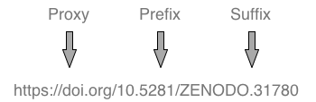
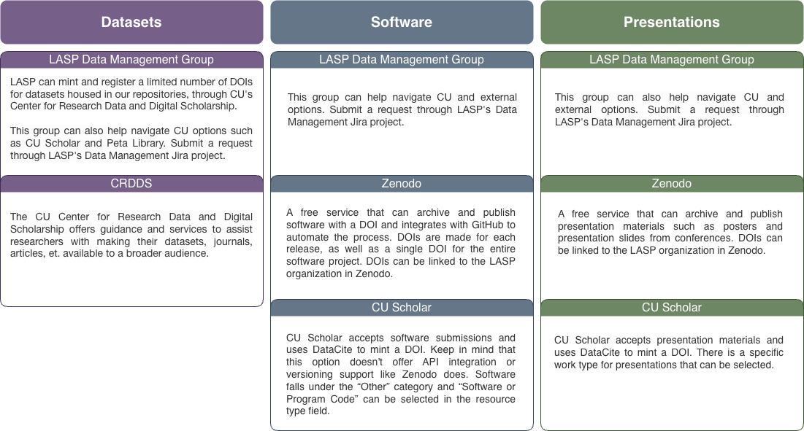

# Digital Object Identifiers

A Digital Object Identifier (DOI) is a code used to uniquely
identify content of various types. DOIs enable easy online
access to research data for discovery, attribution, and reuse,
and enable accurate data citation and other metrics.  DOIs are
a persistent identifier, and as such carry expectations of
curation, persistent access, and rich metadata.

There is a system and practices associated with DOI usage,
for "persistent and actionable identification and interoperable
exchange of managed information on digital networks"
(https://support.datacite.org/docs/doi-basics).

DOIs are intended to be "resolvable," usually to information
about the object to which the DOI refers—including information
about where the object can be found.  For a dataset, that would
be a dataset landing page providing information about the
dataset like where it can be accessed.  The DOI should not
point to the dataset itself.  The DOI remains fixed over the
lifetime of the object, whereas its location and metadata may
change.   When the location changes, the publisher of the
object is responsible for updating the metadata for the DOI
to the new locations.

The developer and administrator of the DOI system is the
International DOI Foundation (IDF) which introduced DOIs
in 2000.  Organizations that meet the contractual obligations
of the DOI system and that are willing to pay to become a
member (such as DataCite, see below) can assign DOIs.

The DOI system is implemented through a federation of
registration agencies coordinated by the IDF.
See https://www.doi.org/, and particularly
https://www.doi.org/hb.html, the DOI Handbook, for details.

## Purpose of DOIs

Funding agencies and publishers increasingly recognize that
datasets and scientific software are valuable research outputs
that should be openly available, identifiable, and citable—often
through DOIs.

At LASP, digital objects worthy of identification include
datasets and associated outputs (e.g., documentation, papers,
workflows, algorithms, software, etc.).

## DOI registries

To enable accessibility, a DOI needs to reside in a registry
where it can be resolved.   The registry collects and provides
high level information, assigns DOIs, and links to references.

#### [DataCite](https://datacite.org/)
DataCite is a not-for-profit, global
initiative to "help the research community locate, identify,
and cite research data with confidence," through DOI minting
and registration.   It is the leading global provider of DOIs
for datasets.   From their website:

>By working closely with data centres to assign DOIs to
> datasets and other research objects, we are developing a
> robust infrastructure that supports simple and effective
> methods of data citation, discovery, and access. Citable
> data become legitimate contributions to scholarly
> communication, paving the way for new metrics and
> publication models that recognize and reward data sharing.

CU Libraries are now a member of DataCite.  Through this
membership, LASP can mint and register DOIs for datasets
housed in our repositories, enabling data to be persistently
identified, accessed, and cited.

#### [Crossref](https://www.crossref.org/)
Crossref is another registry that
is often mentioned in Earth and space science contexts. It's
a not-for-profit association of ~2000 voting member publishers
who represent 4300 societies and publishers.  It exists to
facilitate the links between distributed content hosted at
other sites, and uses DOIs to do so.

#### [Zenodo](https://zenodo.org/)
Zenodo is a free repository developed
by CERN and operated by OpenAIRE.  It is a general-purpose
repository that allows researchers to deposit datasets,
research software, reports, and any other research-related
digital artifacts.  Zenodo assigns DOIs to the deposited
content, making it citable and discoverable.
See [citing software](../workflows/open_source/citing_software.md)
for more on using Zenodo to cite software.

#### [ORCiDs](https://orcid.org/)
ORCiDs are like DOIs but provide
persistent digital object identifiers for people.

## DOI Format

When a LASP researcher needs a DOI, they will provide some information and receive a DOI back.
They will never actually create a DOI.   Nevertheless, it is worth understanding the form of a DOI
and the goals behind its format.

DataCite goals for DOIs include enabling robots and crawlers to recognize DataCite DOIs as URLs,
making them easy to cut and paste, and helping users recognize that DOIs are both a persistent link
and a persistent identifier.

This is a DOI:

https://doi.org/10.5281/ZENODO.31780
A DOI name consists of three parts:

The proxy is an HTTP URL.  DataCite recommends that all DOIs are permanent URLs.
(Using the old DOI protocol, e.g. doi:/10.5281/ZENODO.31780 is NOT recommended.)

A DOI prefix always starts with "10." and continues with a number.  This number
defines a globally unique namespace.  (The scope of "global" depends on the organization
managing multiple repositories.)   Prefixes should not have semantic meaning.  Adding
meaning to the identifier is risky because "despite besting intentions, all names can
change over time" [DataCite DOI Basics](https://support.datacite.org/docs/doi-basics).

The suffix for a DOI can be almost any string.   Here is where information provided in an
input form may be integrated into the DOI.

Note that DOI names are not case-sensitive, while URLs are case-sensitive:
https://support.datacite.org/docs/datacite-doi-display-guidelines.

## Navigating DOI Options at LASP
There are internal and external options available for creating DOIs for various types of products
including datasets, software, and presentations. If you're not
sure where to start, reach out to the LASP Data Management team for guidance by submitting
a Jira issue with type "DOI" in the [Data Management Jira project](https://jira.lasp.colorado.edu/projects/DATAMAN/).

## Useful Links

- [DataCite: DOI Basics](https://support.datacite.org/docs/doi-basics)
- [DataCite: DOI Handbook](https://www.doi.org/the-identifier/resources/handbook/)
- [DataCite: DOI Display Guidelines](https://support.datacite.org/docs/datacite-doi-display-guidelines)
- [Creating a DOI via CU Libraries and DataCite](creating_a_doi.md)

## Acronyms

- **DOI** = Digital Object Identifier
- **IDF** = International DOI Foundation
- **ORCID** = Open Researcher and Contributor ID

Credit: Content taken from a Confluence guide written by Anne Wilson and Shawn Polson.