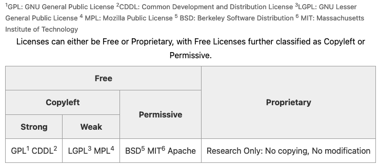

# Licensing

Licenses provide legally binding guidelines for the use and distribution of software and data. Licenses can be
proprietary or free and open source.

## Purpose for this guideline

In Data Systems, many of our code repositories are open source. An open source license gives others explicit permission
to use any part of the code legally. This guide provides options for choosing the right license for your project.

## Options for this guideline

### Software

To avoid copyright concerns, it is recommended that:

1. Any software created by LASP is properly licensed to provide sufficient guidance on their usage
2. Any software used by LASP are licensed and used accordingly to protect against potential legal action from the owner
   of that intellectual property

The following table is taken from [The Turing Way](https://the-turing-way.netlify.app/reproducible-research/licensing)
and shows the different categories of licenses available and the types of licenses that support their respective
requirements.

Free Licenses are classified as Copyleft or Permissive. Copyleft licenses (GPL-style) say that all derivative works must
preserve the same rights as the original work. So, if it is an open-source program currently, you can NOT use that code
in your closed-source program. Because of this, many people don’t consider this as “open” as the more permissive
licenses that would allow someone else to use their code in a commercial closed-source product.

In general, choose a permissive license for your project in Data Systems.

Some fairly common options:

* [BSD-3](https://opensource.org/license/BSD-3-Clause) - Commonly used in the Python scientific community
* [MIT](https://opensource.org/license/MIT) - Short and sweet, very similar to BSD-3
* [Apache-2](https://opensource.org/license/apache-2-0) - Commonly used in the Java/Scala communities

Some examples from groups at LASP:

* MIT: <https://github.com/SWxTREC/enlilviz>
* Apache-2: <https://github.com/latis-data/latis3/>

*NOTE: There is a NASA Open Source License: <https://opensource.gsfc.nasa.gov/nosa.php>; However, it DOES NOT satisfy
the Free Software Foundation’s definition of open source.*

### Data

A creative commons license can be used to restrict who can use data and how they use it.

Creative Commons: <https://creativecommons.org/choose/>

Data rights qualifiers

* BY – Credit must be given to you, the creator.
* NC – Only noncommercial use of your work is permitted.
* ND – No derivatives or adaptations of your work are permitted.
* SA – Adaptations must be shared under the same terms.

You can mix and match the qualifiers on the data rights depending on what limitations you want to enact on the data
you’re distributing/producing.

* CC0 1.0 - dedicate your work to the public domain, no copyright
* CC BY 4.0 - Anyone can use the data/work, even for commercial purposes, but credit must be given to you
* CC BY-NC 4.0 – Anyone can use the data/work, but NOT for commercial purposes (i.e. others can’t use your work to sell
                 their software or product)
* CC BY-NC-ND 4.0 – Anyone can use the data/work, but NOT for commercial purposes and NO derivate works (adaptations).
* CC BY-NC-SA 4.0 – Anyone can use the data/work, but NOT for commercial purposes and the work must be shared alike
                    (SA), meaning it must have the same terms of use.

## How to apply this guideline

<!-- markdownlint-disable-next-line MD024 -->
### Software

1. CU Venture Partners (CU lawyers) recommend using BSD-3 license.
2. Make sure that you put the license file in the root directory and call it `LICENSE` or `LICENSE.md` so that the code
   repository (GitHub, GitLab, Bitbucket) can immediately identify what license your code is released under and let
   contributors know.
3. Fill out the copyright, noting that it is NOT LASP, but *Regents of CU. Copyright (c) YYYY, Regents of the University
   of Colorado*

## Useful Links

* [Public license selector](https://ufal.github.io/public-license-selector/)
* [Choose a license](https://choosealicense.com/)
* [Open Source Initiative (OSI)](https://opensource.org/licenses)
* [The Turing Way overview of licensing](https://the-turing-way.netlify.app/reproducible-research/licensing)
* [Free and Open Source License Comparison chart](https://en.wikipedia.org/wiki/Comparison_of_free_and_open-source_software_licenses)
*