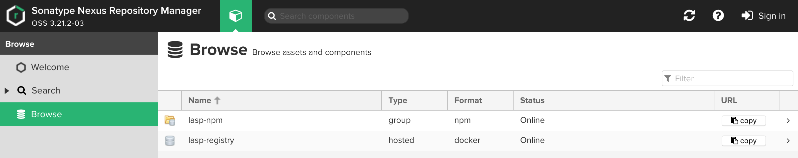
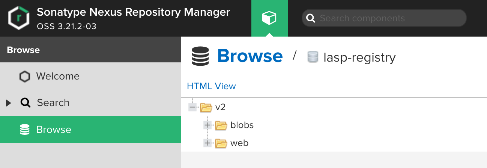
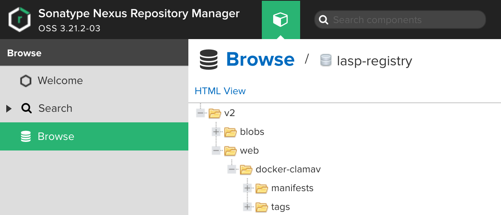
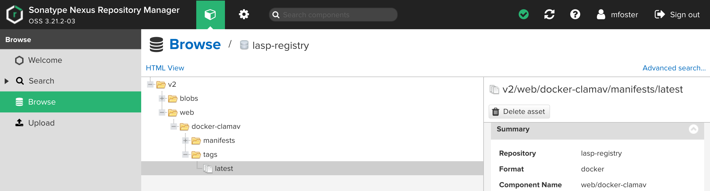
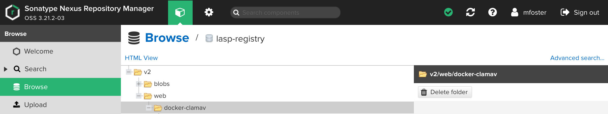

# LASP Docker Registry

## Purpose for this guideline

This document provides guidelines on how to use the LASP Docker registry for publishing and accessing Docker images.

## Overview

The Web Team manages an on-premises Docker registry exclusively used by LASP. The purpose of this registry is to enable
teams within LASP to publish and access Docker images. These Docker images can be created ad-hoc or in an automated
fashion using a Dockerfile located in a corresponding Bitbucket repository. Additionally, the registry can be made
available for access from the internet, behind WebIAM authentication to be used by cloud resources such as AWS.

The LASP Docker Registry is the Sonatype Nexus Repository Pro version. It runs in the DMZ and is behind WebIAM user
authentication.

## Accessing the registry

The Web UI for Nexus is located at https://artifacts.pdmz.lasp.colorado.edu. It is not necessary to log into the server
to search and browse public repositories using the left-hand navigation menu.

> **Warning**: The UI is only accessible from inside the LASP Network.

The internal URL for the Docker repository when using Docker `push`/`pull` commands is
`docker-registry.pdmz.lasp.colorado.edu`. The same repository can also be accessed externally at
`lasp-registry.colorado.edu`.

The difference in URLs is that the Nexus server is intended to be used for different types of artifacts that can be
served and managed via HTTPS. The Docker registry is a special repository and is running on a different port and
protocol. It cannot be accessed via HTTPS.

The LASP Docker registry can be accessed outside the LASP Network using Docker CLI commands (i.e `docker push` or
`docker pull`) by the URL `lasp-registry.colorado.edu`. This allows users to access Docker images from AWS, for example.

## Namespaces

The LASP Docker registry is organized by Namespaces. This is just a sub-folder or path that is used to group all related
images together. Namespaces can be organized by teams or missions. Once a Namespace has been identified, ACLs will be
created in Nexus that allow only specific WebIAM groups to create or push images to the Registry as well as delete
images. Images will be referred to in Docker as `<namespace>/<image>:<tag>` or more precisely
`<registry>/<namespace>/<image>:<tag>`. See [Creating Images](TODO: add link) below for more information.

## Browsing images

Access the Web UI via the URL above. Click on **Browse**:



Click **"lasp-registry"**:



Pick a team or project and expand it. Here you can see the available images under the "web" Namespace:



> **Info**: Each Layer of a Docker image is composed of "Blobs". These are kept outside of the Namespace, but are
> referenced and used by the manifests.

You can find each available tag and its relevant metadata here.

## Creating an Image

### Manually

1. From the root directory where your Dockerfile lives, build a local image specifying an image name and tag (i.e.
   `image_name:tag_version`):

```bash
$ docker build --force-rm -t webtcad-landing:1.0.2 .
Sending build context to Docker daemon 22.78 MB
Step 1 : FROM nginx:1.12.2
 ---> dfe062ee1dc8
...
...
...
Step 8 : RUN chown -R nginx:nginx /usr/share/nginx/html     && chown root:root /etc/nginx/nginx.conf
 ---> Running in 8497cc7f30ed
 ---> 28cb8c0df12b
Removing intermediate container 8497cc7f30ed
Successfully built 28cb8c0df12b
```

2. Tag your new image with the format `<registry_URL>/<namespace>/image_name:tag`:

```bash
$ docker tag 28cb8c0df12b docker-registry.pdmz.lasp.colorado.edu/web/webtcad-landing:1.0.2
```

> **Info**: Note the "web" namespace in the URL above. This will change depending on your particular Namespace.

3. Login to the remote registry using your username/password:

```bash
$ docker login docker-registry.pdmz.lasp.colorado.edu
Username:
```

4. Push the image into the repository/registry:

```bash
$ docker push docker-registry.pdmz.lasp.colorado.edu/web/webtcad-landing:1.0.2
```

5. Logout of the registry when complete. This removes credentials stored in a local file.

```bash
$ docker logout
```

> **Info**: Don't forget to delete your local images if you no longer need them.


### Automated

To script the process of creating an image, you can use something like Ansible with its
["docker_image"](https://docs.ansible.com/ansible/latest/collections/community/docker/docker_image_module.html) module
or something simple as a build script in your Bitbucket repo or Jenkins Job with the above commands invoked in a Shell
Builder. The Web Team utilizes all three methods when creating images.

## Deleting

Although deleting a Docker image can be done via API commands against the registry, it is best done via the Web UI. To
do so, login to the Registry and then Browse to the particular image:tag you wish to delete:



Click the "Delete Asset" button.

If you no longer need that particular image at all, you can delete the folder associated with it by selecting the folder
and clicking "Delete Folder":




## Pulling an image

1. Login to the remote registry using your username/password. Note that this is only necessary if you are accessing a
docker image that is NOT in a public namespace:

```bash
$ docker login docker-registry.pdmz.lasp.colorado.edu
Username:
```

2. Pull the image from the repository/registry:

```bash
$ docker image pull docker-registry.pdmz.lasp.colorado.edu/web/webtcad-landing:1.0.2
```

3. Logout of the registry when complete. This removes credentials stored in a local file:

```bash
$ docker logout
```

## Requesting Access

Write access and new Namespaces require The Web Team to create WebIAM groups and Nexus ACLs. Please submit a Jira
WEBSUPPORT ticket or send an email to `web.support@lasp.colorado.edu`