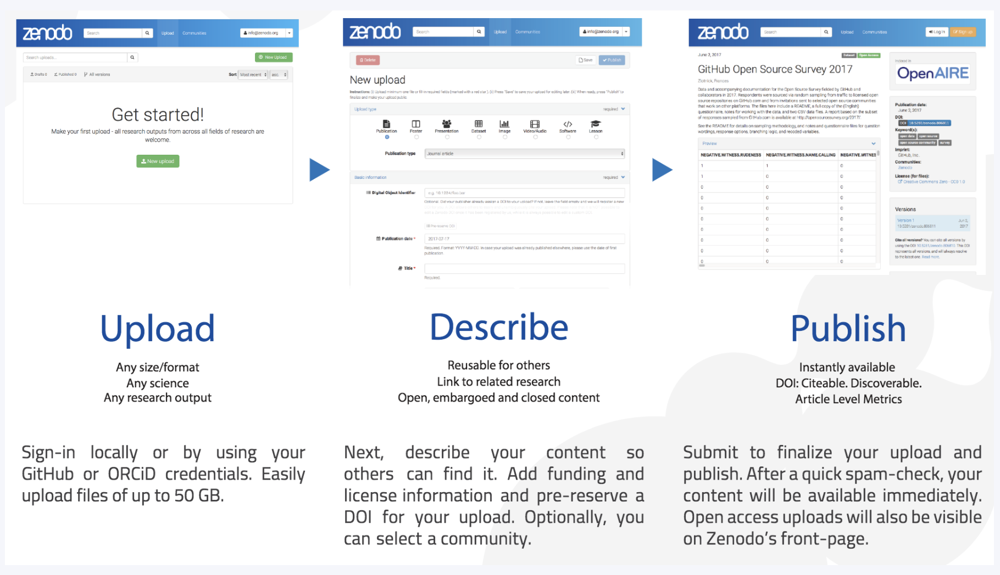

# Citing Software

This guideline provides information on how to publish, archive, and create a citable DOI for your project.

## Purpose
Publishing code offers benefits including preserving code, making it accessible
to others, and enabling users of code to cite and reproduce it - all key components of
open science goals. Additionally, it supports compliance with NASA's SPD-41a policy which
requires the open sharing of publications, data, and software created by SMD-funded scientific
activities. Below are steps for how to publish, archive, and create a citable DOI for your project.

## Options for citing your software
Zenodo is a free service developed by researchers to support archiving and publishing code, datasets, and other
research outputs. Software can be archived and assigned a DOI through Zenodo, and it's integration with GitHub
automates a lot of the work. For each software release, Zenodo uses GitHub's APIs to create and store a zipped
copy of the code and extract metadata from the repository to mint a DOI. This information then becomes available
through Zenodo's website. Note, that in addition to DOIs for each release, Zenodo creates a single DOI for the entire
project.

## How to create a citable DOI for your software

#### Using Zenodo's GitHub integration:
1. **Make your code public**: If your code is not already public, make it public on GitHub. Ensure that you have
  an ownership role. This will enable Zenodo integration with your repository for automatic publishing of each
  software release.
2. **Create a `citation.cff file`**: Add this file to the root directory of your GitHub repository. This is a plain
  text file with human- and machine-readable citation information for your code repository. It includes basic
  metadata such as author, name of the software, brief abstract, organization name, etc. Zenodo will scrape this
  file for specific metadata you want included in your DOI.

   +   [More information on citation.cff](https://citation-file-format.github.io/#/supported-by-zenodo-)

   +   [cff file generator tool](https://citation-file-format.github.io/cff-initializer-javascript/#/)
3. **Create a free Zenodo account**: Go to [Zenodo](https://zenodo.org/) and create an account.
4. **Connect your GitHub account**: Follow these steps to connect your GitHub account to Zenodo:
   +   Log into Zenodo with your GitHub credentials.
   +   Go to your Zenodo account settings.
   +   Click on the "GitHub" tab
   +   Authorize the repositories you want to connect to Zenodo.
5. **Create a new release**: When you create a new release on GitHub, Zenodo will automatically create a DOI for your code.
6. **Cite your code**: Add the DOI provided by Zenodo to your repository to make it easy for others to cite your code.
    + Go to your Zenodo account settings.
    + Click on the "GitHub" tab
    + Click on the DOI badge icon next to the repository to get the markdown code to add a DOI badge to your repository's
      `README.md` file.

#### Manually uploading to Zenodo:
Don't have a GitHub account? If you're using bitbucket or another service, a DOI can still be created by
manually uploading it to Zenodo.
1. **Create a Zenodo account**: Go to [Zenodo](https://zenodo.org/) and create an account.
2. **Create a new upload**: Click on the "Upload" button and follow the prompts to upload your code.
3. **Describe your upload**: Fill in the metadata fields to describe your upload. This information will be used to create a DOI for your project.
4. **Publish your upload**: Click on the "Publish" button to publish your code and create a DOI.
5. **Update your code**: If you make changes to your code, you can create a new release on GitHub to create a new version with a new DOI.

#### Once set up with Zenodo, you can:
* **Cite your code**: Use the DOI provided by Zenodo to cite your code in publications and other research outputs.
* **Get credit for your code**: Zenodo provides metrics on the usage of your code, including downloads and citations.

Note: The total file size limit per record is 50GB (max 100 files). A one-time 100GB quota can be requested and granted on a case-by-case basis.

## Helpful resources
* [Learn more about NASA's SPD-41a policy](https://science.nasa.gov/researchers/science-information-policy/)
* [Learn more about Zenodo](https://about.zenodo.org/)
* [Step-by-step instructions using Zenodo from the University of Iowa](https://www.lib.uiowa.edu/data/files/2022/10/Share_and_Preserve_Your_Code_20220728.pdf)
* [GitHub's information on using Zenodo](https://docs.github.com/en/repositories/archiving-a-github-repository/referencing-and-citing-content)
* There are multiple ways to cite authors for software. One method is to list the name of each contributor.
  Since the list of contributors may change from release to release, a contributors list in the repository
  can help track these updates and ensure proper attribution. Another option is to list a group or organization
  as the author (i.e.  `<project name>` Developers) and recognize individual contributors via the all-contributors bot.
  The [icepyx software](https://icepyx.readthedocs.io/en/development/contributing/attribution_link.html) provides a
  good example of this second approach, which follows guidance from the [Turing Way](https://the-turing-way.netlify.app/communication/aa/aa-equitable)
  project.

## Acronyms

* **DOI** = Digital Object Identifier
* **API** = Application Programming Interface
* **SMD** = Science Mission Directorate

Credit: Content taken from a Confluence guide written by Veronica Martinez
